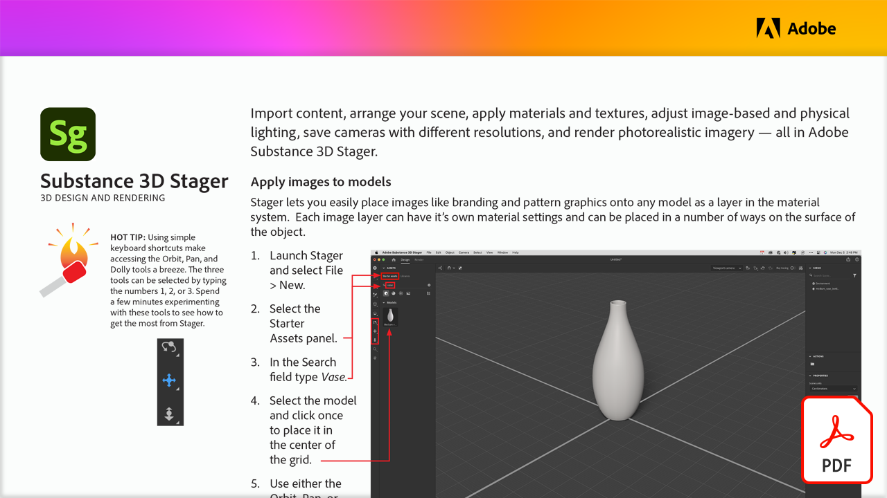

# Design e renderização 3D

Importe conteúdo, organize sua cena, aplique materiais e texturas, ajuste a iluminação física e baseada em imagem, salve câmeras com diferentes resoluções e renderize imagens fotorrealistas, tudo no Adobe Substance 3D Stager.

Selecione a imagem abaixo para ver ou baixar este tutorial do PDF.

[{width="680"}](assets/Adobe-Substance-Stager.pdf){target="blank"}
