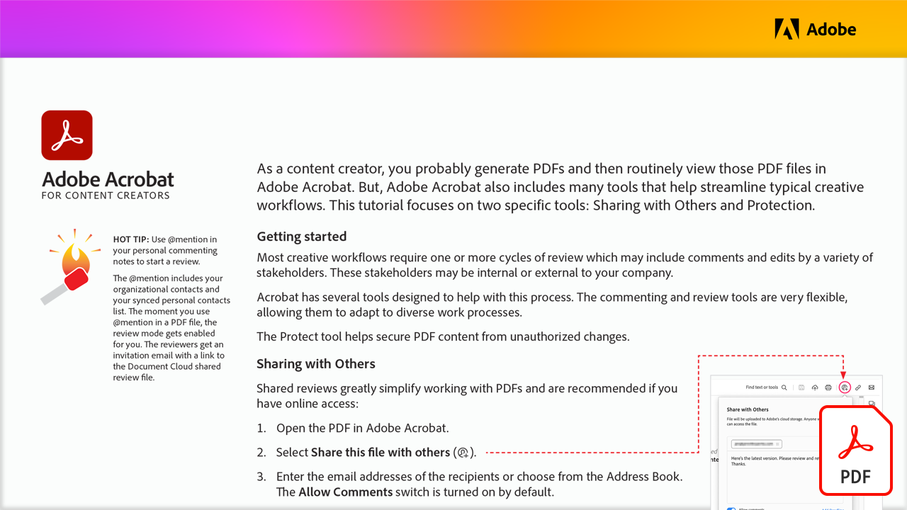

# Acrobat para criadores de conteúdo

Como criador de conteúdo, você provavelmente gera PDF e, em seguida, visualiza regularmente esses arquivos PDF no Acrobat. Mas há muitas outras ferramentas que ajudam a simplificar fluxos de trabalho criativos típicos.

Selecione a imagem abaixo para visualizar ou baixar este tutorial em PDF.

[{&quot;width=680&quot;}](assets/Acrobat-for-Content-Creators.pdf){target=&quot;blank&quot;}
