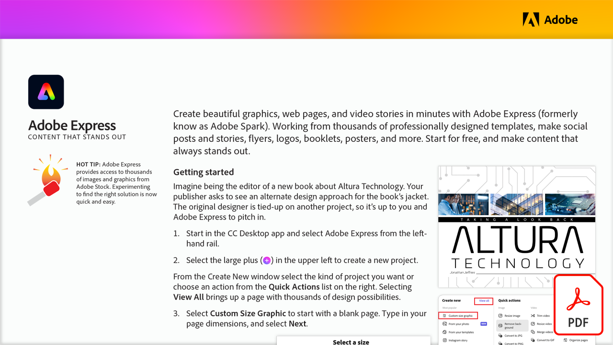

# Adobe Express: Conteúdo que se destaca

Crie belas imagens, páginas da Web e histórias em vídeo em minutos com o Adobe Express (conhecido anteriormente como Adobe Spark). Trabalhe com milhares de modelos criados profissionalmente, faça publicações e histórias para redes sociais, folhetos, logotipos, livretos, pôsteres e muito mais. Comece gratuitamente e crie conteúdo que sempre se destaque.

Selecione a imagem abaixo para ver ou baixar este tutorial do PDF.

[{”width=680”}](assets/Adobe-Express-content-that-stands-out.pdf){target="blank"}
