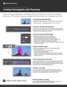

# Criação de cinemágrafos com o Photoshop

Neste tutorial em vídeo de workshop passo a passo, crie uma fotografia viva combinando o vídeo do Adobe [!DNL Stock] com técnicas de mascaramento inteligentes no Photoshop.

>[!VIDEO](https://video.tv.adobe.com/v/331002?hidetitle=true)

  

[**Baixar o Guia de PDF de Referência Rápida**](../quick-reference/CreatingCinemagraphswithPhotoshop.pdf)

