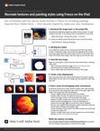

# Experimente Fresco no iPad (e iPhone)

Explore um mundo totalmente novo de desenho e pintura digital com o Adobe Fresca neste workshop prático de 15 minutos. Aprenda rapidamente a trabalhar com camadas e máscaras de corte para adequar a pintura e as texturas a uma forma de base. Acompanhe Chris Converse, designer/desenvolvedor, para recriar parte de uma ilustração de natureza morta usando Fresco e Adobe Stock.

>[!VIDEO](https://video.tv.adobe.com/v/333804?hidetitle=true)

  

[**Baixar o Guia de PDF de Referência Rápida**](../quick-reference/Frescoworkshop.pdf)

