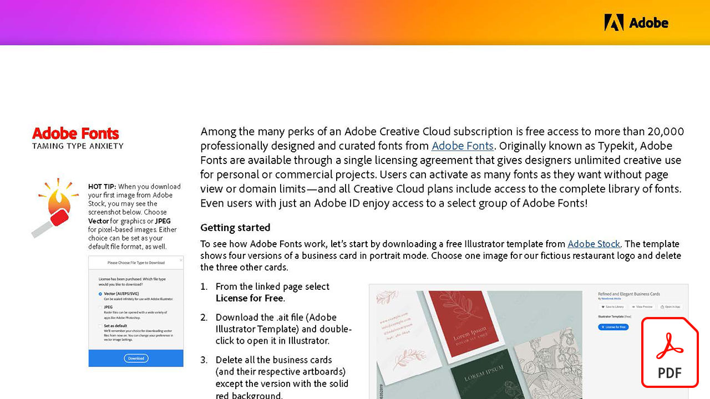

# Creative Cloud para tutoriais corporativos

Como criativo corporativo, você deve colaborar com equipes distribuídas, estabelecer processos dimensionáveis e estar em conformidade com sistemas e diretrizes corporativas. Esses tutoriais ajudam você a aprender novos recursos em Creative Cloud, sob uma perspectiva corporativa.

## Clique para ver um tutorial de produto (listado em ordem alfabética)

### Adobe Acrobat

<table style="table-layout:fixed">
<tr>
 <td>
   
    

   <a href="acrobat-content-creators.md"><strong>Acrobat para criadores de conteúdo (PDF)</strong></a>
    

    <em>Saiba mais sobre as ferramentas do Acrobat que ajudam a simplificar fluxos de trabalho de criação</em>
     
  </td>
  <td>
    
    

     
  </td>
  <td>
    
    

     
  </td>
  <td>
    
    

     
  </td>
</tr>
</table>

### Adobe Express (antigo Adobe Spark)

<table style="table-layout:fixed">
<tr>
 <td>
   
    

   <a href="assets/AddingaGlideshowtoyourSparkPageAdobeBlog.pdf"><strong>Adicionar uma apresentação de slides à sua Spark Page (PDF)</strong></a>
    

    <em>O Adobe Spark oferece alguns componentes de layout incríveis e fáceis de usar que dão vida às suas histórias na Web</em>
     
  </td>
  <td>
   
    

   <a href="assets/CreatingYourBrandinAdobeSpark.pdf"><strong>Criação da sua marca no Adobe Spark (PDF)</strong></a>
    

    <em>O Adobe Spark facilita a definição da sua marca</em>
     
  </td>
  <td>
   
    

   <a href="assets/MeetYourNewProductionArtistAdobeSparkPost.pdf"><strong>Conheça Seu Novo Artista De Produção: Adobe Spark Post (PDF)</strong></a>
    

    <em>O Adobe Spark aprende com você ao criar layouts, definir cores, importar arte e organizar elementos em suas composições</em>
     
  </td>
  <td>
    
    

     
  </td>
</tr>
</table>

### Adobe Portfolio

<table  style="table-layout:fixed">
<tr>
   <td>
   
    

   <a href="assets/GettingStartedWithAdobePortfolio.pdf"><strong>Introdução Ao Adobe Portfolio (PDF)</strong></a>
    

    <em>Compartilhar seu melhor trabalho com a Adobe Portfolio é uma maneira eficaz de compartilhar seu sucesso e atrair novos talentos criativos</em>
     
  </td>
  <td>
   
    

   <a href="assets/ConnectingLightroomandBehancetoYourAdobePortfolio.pdf"><strong>Conexão do Lightroom e do Bēhance ao Adobe Portfolio (PDF)</strong></a>
    

    <em>Usar projetos do Behance como páginas em seu portfólio</em>
     
  </td>
  <td>
   
    

   <a href="assets/ShowYourBestWorkwithAdobePortfolio.pdf"><strong>Exiba seu melhor trabalho com o Adobe Portfolio (PDF)</strong></a>
    

    <em>O Adobe Portfolio permite que você faça upload, organize e compartilhe seu trabalho com possíveis funcionários e clientes em todo o mundo</em>
     
  </td>
  <td>
    
    

     
  </td>
 </tr>
 </table>

### Bibliotecas da CC

<table  style="table-layout:fixed">
<tr>
  <td>
   
   

   <a href="cc-workflows-cc-libraries.md"><strong>Aprimore fluxos de trabalho da CC com as Bibliotecas da CC</strong></a>
    

    <em>Saiba como as Bibliotecas Creative Cloud mantêm os elementos de design juntos, garantindo a consistência do projeto para designers e equipes</em>
     
  </td>
  <td>
   
   

   <a href="ccteamlibraries.md"><strong>Criação de bibliotecas Creative Cloud para equipes</strong></a>
    

    <em>Saiba como compartilhar ativos em um grupo ou equipe usando as Bibliotecas Creative Cloud para equipes</em>
     
  </td>
  <td>
   
   

   <a href="sharecclibraries.md"><strong>Compartilhamento de ativos de identidade visual com as Bibliotecas Creative Cloud para equipes</strong></a>
    

    <em>Saiba como criar, usar e compartilhar ativos de marca para seu grupo ou equipe usando as Bibliotecas Creative Cloud para equipes</em>
     
  </td>
  <td>
   
    

   <a href="assets/CreateAddandShareYourBrandAssetswithCreativeCloudLibraries.pdf"><strong>Crie, adicione e compartilhe seus ativos de marca com as Bibliotecas Creative Cloud (PDF)</strong></a>
    

    <em>As Bibliotecas da Creative Cloud fornecem um sistema integrado de marca que permite aos designers compartilhar ativos de marca entre equipes criativas</em>
     
  </td>
  </tr>
  <tr>
  <td>
   
    

   <a href="assets/ShareTextStylesFromIllustratorwithCreativeCloudLibraries.pdf"><strong>Compartilhar estilos de texto do Illustrator com bibliotecas Creative Cloud (PDF)</strong></a>
    

    <em>Trabalhe com mais inteligência e facilidade no Illustrator</em>
     
  </td>
  <td>
    
    

     
  </td>
  <td>
    
    

     
  </td>
  <td>
    
    

     
  </td>
</tr>
</table>

### Creative Cloud para corporações

<table style="table-layout:fixed">
<tr>
 <td>
   
    

   <a href="assets/FromHandLetteringtoIllustratorviaCreativeCloud.pdf"><strong>De letras desenhadas à mão para Illustrator via Creative Cloud (PDF)</strong></a>
    

    <em>Com o poder do Creative Cloud para corporações, os aplicativos para desktop e dispositivos móveis da Adobe permitem capturar, converter e criar em qualquer lugar e dispositivo</em>
     
  </td>
  <td>
   
    

   <a href="assets/FromLightroomWebtoInDesignviaCreativeCloud.pdf"><strong>Da Lightroom Web ao InDesign via Creative Cloud (PDF)</strong></a>
    

    <em>Leve sua criatividade da câmera ao design final com arquivos e bibliotecas Creative Cloud</em>
     
  </td>
  <td>
    
    

     
  </td>
  <td>
    
    

     
  </td>
</tr>
</table>

### [!DNL Dimension]

<table  style="table-layout:fixed">
<tr>
   <td>
   
    

   <a href="assets/VisualizeyourProductinaRealisticEnvironment.pdf"><strong>Visualize seu produto em um ambiente realista (PDF)</strong></a>
    

    <em>Quando quiser ver como seus produtos ficam no mundo real, Adobe [!DNL Dimension] é seu aplicativo de acesso</em>
     
  </td>
  <td>
    
    

     
  </td>
  <td>
    
    

     
  </td>
  <td>
    
    

     
  </td>
</tr>
</table>

### Fresco

<table>
<tr>
 <td>
   
    

   <a href="frescoworkshop.md"><strong>Experimente Fresco no iPad (e no iPhone)</strong></a>
    

    <em>Explore um mundo totalmente novo de desenho e pintura digitais com o Adobe Fresca neste workshop prático de 15 minutos</em>
     
  </td>
  <td>
    
    

     
  </td>
  <td>
    
    

     
  </td>
  <td>
    
    

     
  </td>
</tr>
</table>

### Fonts

<table  style="table-layout:fixed">
<tr>
<td>
   
    

   <a href="Taming-font-anxiety.md"><strong>Ansiedade do tipo de domesticação (PDF)</strong></a>
    

    <em>Saiba como acessar e usar mais de 20 mil fontes de design profissional no Creative Cloud</em>
     
  </td>
  <td>
   
    

   <a href="assets/CreatingBeautifulTypographywithCreativeCloud.pdf"><strong>Criação de uma bela tipografia com Creative Cloud (PDF)</strong></a>
    

    <em>Saiba como aproveitar os controles tipográficos avançados disponíveis em suas ferramentas de design favoritas</em>
     
  </td>
   <td>
   
    

   <a href="assets/DiscoveringFontswithCreativeCloud.pdf"><strong>Descobrindo fontes com Creative Cloud (PDF)</strong></a>
    

    <em>Às vezes, encontrar a fonte certa para um projeto pode parecer assustador. Com vários aplicativos e serviços do Creative Cloud, encontrar a fonte certa agora é divertido e inspirador</em>
     
  </td>
  <td>
   
    

   <a href="assets/UnleashHiddenGemsinOpenTypefonts.pdf"><strong>Libere gemas ocultas em fontes de OpenType (PDF)</strong></a>
    

    <em>O formato de OpenType permite que uma fonte contenha até 65.536 glifos</em>
     
  </td>
</table>

### Illustrator

<table  style="table-layout:fixed">
<tr>
   <td>
   
    

   <a href="assets/GettoKnowGraphicStylesinIllustrator.pdf"><strong>Conheça os estilos de gráfico no Illustrator (PDF)</strong></a>
    

    <em>O Illustrator oferece a capacidade de estilizar a arte final da mesma maneira que você estiliza o texto</em>
     
  </td>
   <td>
   
    

   <a href="assets/WorkSmarterNotHarderwithIllustrator.pdf"><strong>Trabalhe com mais inteligência e facilidade com o Adobe Illustrator CC (PDF)</strong></a>
    

    <em>Acelere seus desenhos vetoriais no Illustrator</em>
     
  </td>
  <td>
   
    

   <a href="assets/IllustratorSymbolsandLayersequalsPerfectStructureforResponsiveSVG.pdf"><strong>Símbolos Illustrator + Camadas = estrutura perfeita para SVG responsivo! (PDF)</strong></a>
    

    <em>O Illustrator oferece suporte inigualável ao formato SVG, incluindo a capacidade de criar símbolos, grupos, IDs e definições vetoriais precisas de sua ilustração</em>
     
  </td>
  <td>
    
    

     
  </td>
</tr>
</table>

### InDesign

<table  style="table-layout:fixed">
<tr>
  <td>
   
    

   <a href="assets/CreatingInteractivePDFsfromInDesign.pdf"><strong>Criação de PDF interativos a partir do InDesign (PDF)</strong></a>
    

    <em>O InDesign contém muitos recursos que ajudam a formatar, estilizar, gerenciar e rastrear o conteúdo dos documentos</em>
     
  </td>
   <td>
   
    

   <a href="assets/EasilyGatherandIncorporateDesignFeedbackwithAdobeAcrobatandInDesign.pdf"><strong>Reúna e incorpore facilmente os comentários do design com o Adobe Acrobat e o InDesign (PDF)</strong></a>
    

    <em>Os envolvidos no projeto podem usar o Acrobat para adicionar comentários e anotações detalhados e, assim, você pode rapidamente trazer essas marcações de volta ao Adobe InDesign para vê-las no contexto do seu layout</em>
     
  </td>
  <td>
   
    

   <a href="assets/StyleWebContentwithInDesign.pdf"><strong>Estilizar conteúdo da Web com o Adobe InDesign CC (PDF)</strong></a>
    

    <em>Você sabia que pode aproveitar o poder do InDesign para saída de HTML e gráficos da Web?</em>
     
  </td>
  <td>
   
    

   <a href="assets/InteractivePDFBookmarksandLinkedTOCsfromInDesign.pdf"><strong>PDF interativo: Marcadores e sumários vinculados do InDesign (PDF)</strong></a>
    

    <em>Aprenda a usar o recurso Índice Analítico no InDesign para gerar marcadores e hiperlinks que ajudam os leitores a encontrar rapidamente informações em seus arquivos PDF</em>
     
  </td>
</tr>
<tr>
  <td>
   
    

   <a href="assets/InteractivePDFGraphicalHyperlinksandNestedMasterPagesinInDesign.pdf"><strong>PDF interativo: Hiperlinks gráficos e páginas-mestre aninhadas no InDesign (PDF)</strong></a>
    

    <em>A aplicação de hiperlinks com páginas mestras permite gerenciar rapidamente um sistema de navegação em todas as páginas</em>
     
  </td>
  <td>
    
    

     
  </td>
  <td>
    
    

     
  </td>
  <td>
    
    

     
  </td>
</tr>
</table>

### Photoshop

<table style="table-layout:fixed">
<tr>
  <td>
    
    

    <a href="alphabetsoup.md"><strong>Decodificação da sopa de letras dos formatos gráficos</strong></a>
    

    <em>Arquivos JPG, PNG, SVG, GIF e EPS são comumente usados em design, alguns para páginas da Web, outros para apresentações, publicações e projetos criativos. Mas o que elas significam, e qual você deve escolher?</em>
     
  </td>
  <td>
    
    

    <a href="compositepsipad.md"><strong>Criar composições únicas com o Adobe [!DNL Stock] e Photoshop para iPad</strong></a>
    

    <em>Leve o poder do Photoshop ao seu alcance. Aprenda a usar um de seus aplicativos Creative Cloud favoritos de uma maneira totalmente nova, com uma interface baseada em toque reprojetada</em>
     
  </td>
  <td>
    
    

    <a href="cinemagraphps.md"><strong>Criação de cinemagrafias com o Photoshop</strong></a>
    

    <em>Neste tutorial de vídeo passo a passo da oficina, você cria uma fotografia ao vivo combinando vídeo de Adobe [!DNL Stock] com técnicas inteligentes de mascaramento no Photoshop</em>
     
  </td>
  <td>
    
    

    <a href="assets/AddRemarkableLightingtoaPhotowithPhotoshopandAfterEffects.pdf"><strong>Adicione iluminação incrível a uma foto com o Photoshop e o After Effects (PDF)</strong></a>
    

    <em>Aprenda a usar o efeito Explosão de luz no Adobe After Effects para aprimorar drasticamente uma fotografia</em>
     
  </td>
</tr>
<tr>
  <td>
    
    

    <a href="assets/CreateCinemagraphsinaSnapwithPhotoshopandAdobeStock.pdf"><strong>Crie cinemagrafias em um piscar de olhos com o Photoshop e o Adobe [!DNL Stock] (PDF)</strong></a>
    

    <em>Procurando vídeos em loop no Adobe [!DNL Stock] para montar cinemagrafias atraentes rapidamente no Photoshop</em>
     
  </td>
  <td>
    
    

    <a href="assets/CreatingaLivingPhotographwithPhotoshopPart1.pdf"><strong>Criação de uma fotografia ao vivo com o Photoshop — Parte 1 (PDF)</strong></a>
    

    <em>Com o Adobe Photoshop, você pode transformar rapidamente seus vídeos curtos em fotografias reais que impressionam seu público-alvo em qualquer plataforma social</em>
     
  </td>
  <td>
    
    

    <a href="assets/CreatingaLivingPhotographwithPhotoshopPart2.pdf"><strong>Criação de uma fotografia ao vivo com o Photoshop — Parte 2 (PDF)</strong></a>
    

    <em>Combinar fotos com vídeos é uma maneira poderosa de adicionar qualidade envolvente às suas fotos sem sacrificar a mensagem ou o tom da imagem original</em>
     
  </td>
  <td>
    
    

    <a href="assets/PhotoshopAfterEffectsAwesomenessAdobeMAX2018LabRecap.pdf"><strong>Photoshop + After Effects = Incrível: Recapitulação de laboratório do Adobe MAX 2018 (PDF)</strong></a>
    

    <em>Neste laboratório prático e passo a passo, combine o Photoshop com o After Effects para criar imagens e efeitos de cair o queixo adequados para uso em qualquer mídia</em>
     
  </td>
</tr>
<tr>
  <td>
    
    

    <a href="assets/QuicklyBrandYourInstagramPhotoswithAdobePhotoshopActions.pdf"><strong>Marque rapidamente suas fotos do Instagram com ações do Adobe Photoshop (PDF)</strong></a>
    

    <em>Elimine o tédio e poupe muito tempo usando Ações no Photoshop</em>
     
  </td>
  <td>
    
    

    <a href="assets/WorkSmarterNotHarderwithPhotoshop.pdf"><strong>Trabalhe com mais inteligência e facilidade com o Photoshop (PDF)</strong></a>
    

    <em>As alterações no Photoshop podem ser demoradas, mas não precisam ser</em>
     
  </td>
  <td>
    
    

    <a href="assets/AnyoneCanBeCreativewithAdobeCreativeCloud.pdf"><strong>Adicione um pouco de Adobe Photoshop ao seu conjunto de habilidades criativas (PDF)</strong></a>
    

    <em>Adicione um pouco de Adobe Photoshop ao seu conjunto de habilidades criativas</em>
     
  </td>
  <td>
    
    

    <a href="assets/GreenScreenisNotJustforVideo.pdf"><strong>A tela verde não é apenas para vídeo (PDF)</strong></a>
    

    <em>Você pode usar a tela verde em um estúdio de fotos e usar o After Effects para preparar o uso da foto no Photoshop</em>
     
  </td>
</tr>  
</table>
