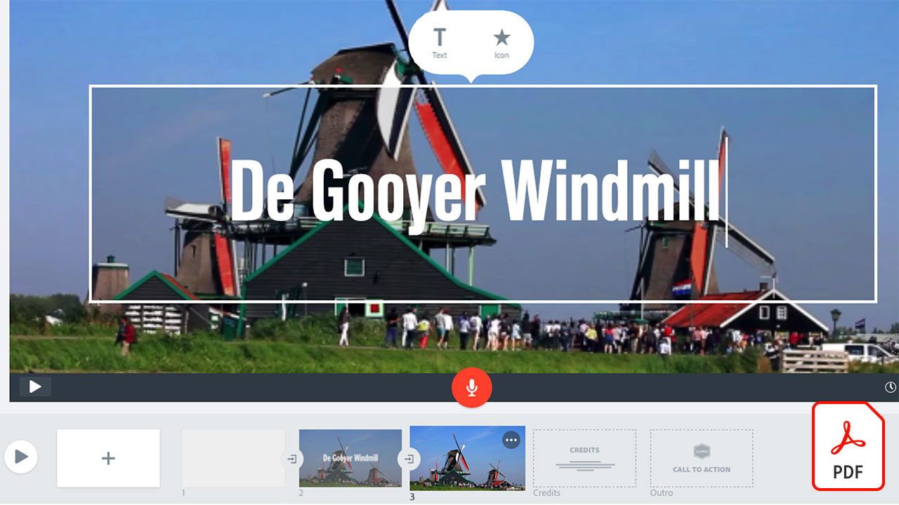

# Guias de referência rápida em vídeo

Dê vida às suas ideias com softwares e aplicativos de Adobe para edição de vídeo, animações, efeitos visuais, animação e muito mais. Selecione uma imagem para baixar ou exibir uma PDF do guia de referência rápida.

## Adobe Audition

<table>
<tr>
   <td>
      
      

      <a href="assets/QuicklyRemoveUnwantedAudioContentwiththeSpotHealingBrushinAdobeAudition.pdf" target="_blank"><strong>Remova rapidamente o conteúdo de áudio indesejado com o Pincel de recuperação para manchas no Adobe Audition (PDF)</strong></a>
      

      <em>Você sabia que o Pincel de recuperação para manchas do Adobe Photoshop permite remover sons perturbadores dos arquivos de áudio no Adobe Audition?</em>
       
  </td>
  <td>
    
    

     
  </td>
  <td>
    
    

     
  </td>
  <td>
    
    

     
  </td>
</tr>
</table>

## Adobe Express (anteriormente Adobe Spark)

<table>
<tr>
<td>
   
    

   <a href="assets/ShowcaseyourSparkVideoinyourSparkPage.pdf" target="_blank"><strong>Mostre seu Spark Video em seu Spark Page (PDF)</strong></a>
    

    <em>O Adobe Spark Page permite carregar vídeos de várias origens, incluindo vídeos criados com o Spark Video.</em>
     
  </td>
  <td>
    
    

     
  </td>
  <td>
    
    

     
  </td>
  <td>
    
    

     
  </td>
</tr>
</table>

## After Effects

<table>
<tr>
 <td>
   
    

   <a href="assets/AfterEffectsforPhotography.pdf" target="_blank"><strong>After Effects para fotografia (PDF)</strong></a>
    

    <em>Aprenda a usar os efeitos surpreendentes no After Effects para aprimorar suas fotografias</em>
     
  </td>
  <td>
   
    

   <a href="assets/CinemagraphsTheMesmerizingPlaceBetweenaPhotoandaVideo.pdf" target="_blank"><strong>Cinemagraphs: o lugar hipnotizante entre uma foto e um vídeo (PDF)</strong></a>
    

    <em>Saiba mais sobre cinemágrafos, aqueles híbridos atraentes que existem em algum lugar entre uma foto e um vídeo</em>
     
  </td>
  <td>
   
    

   <a href="assets/CreateanIllustrationfromanAdobeStockPhotowithAfterEffects.pdf" target="_blank"><strong>Crie uma ilustração a partir de uma foto Adobe [!DNL Stock] com o After Effects (PDF)</strong></a>
    

    <em>Combine o Matiz/Saturação e os Níveis com os efeitos de Desenho animado no After Effects para criar uma ilustração estilizada exclusiva a partir de uma foto em Adobe [!DNL Stock]</em>
     
  </td>
   <td>
   
    

   <a href="assets/CreateBeautifulKaleidoscopePatternswithAfterEffects.pdf" target="_blank"><strong>Criar belos padrões de caleidoscópio com o After Effects PDF)</strong></a>
    

    <em>Crie um número infinito de padrões e texturas, a partir de qualquer imagem, usando o efeito Kaleida do CC no Adobe After Effects</em>
     
  </td>
</tr>
<tr>
<td>
   
    

   <a href="assets/CreateIntricateTransparencyinyourPhotographswithKeyinginAfterEffects.pdf" target="_blank"><strong>Crie uma transparência intrincada em suas fotos com o chaveamento no After Effects (PDF)</strong></a>
    

    <em>O chaveamento é muito usado para vídeo, mas também pode ser muito útil quando suas fotografias são necessárias para projetos de design</em>
     
  </td>
 <td>
   
    

   <a href="assets/CreateAnimatedTitlesUsingMotionGraphicsTemplatesinAdobePremiereRush.pdf" target="_blank"><strong>Criar títulos animados usando modelos de animações no Adobe Premiere [!DNL Rush] (PDF)</strong></a>
    

    <em>Deixe seus vídeos ainda mais incríveis adicionando modelos de animações projetados profissionalmente que se adaptam à sua história ou correspondem à sua marca pessoal</em>
     
  </td>
  <td>
      
      

      <a href="assets/DazzlingLightEffectsforPhotographywithAfterEffects.pdf" target="_blank"><strong>Efeitos de luz deslumbrantes para fotografia com o After Effects (PDF)</strong></a>
      

      <em>Os efeitos de iluminação no Adobe After Effects podem alterar drasticamente a aparência da sua foto</em>
       
  </td>
  <td>
      
      

      <a href="assets/EditingVRPhotography360photoswithAfterEffects.pdf" target="_blank"><strong>Editar fotografia de VR (fotos de 360 graus) com After Effects (PDF)</strong></a>
      

      <em>Embora experiências e jogos interativos mais imersivos não sejam tão comuns, a fotografia em 360 graus já está aqui</em>
       
  </td>
</tr>
</table>

## Premiere Rush

<table>
<tr>
   <td>
      
      

      <a href="assets/SmoothlyCombineMusicandDialogueorNarrationwithAutoduckinginAdobePremiereRush.pdf" target="_blank"><strong>Combine suavemente Música e Diálogo ou Narração com Redução automática em [!DNL Adobe Premiere Rush] (PDF)</strong></a>
      

      O <em>Adobe Premiere [!DNL Rush] oferece recursos avançados de edição de vídeo em um aplicativo fácil de usar, para que qualquer pessoa possa criar um vídeo de qualidade profissional em minutos</em>
       
  </td>
  <td>
    
    

     
  </td>
  <td>
    
    

     
  </td>
  <td>
    
    

     
  </td>
</tr>
</table>
