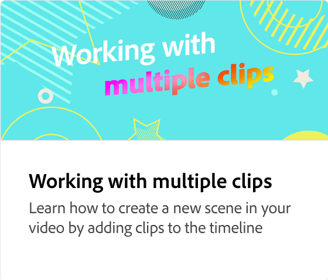

# Como adicionar videoclipes

Saiba como criar vídeos de destaque com rapidez e facilidade usando o recurso de arrastar e soltar na criação de vídeos. Comece com modelos ou seus próprios designs estáticos e adicione sua marca, ativos de design, vídeos e músicas do Adobe Stock e muito mais.

>[!VIDEO](https://video.tv.adobe.com/v/3436427?quality=12&learn=on&hidetitle=true&captions=por_br)

## Vídeos adicionais desta série

<table style="table-layout:fixed">
<tr>
   <td>
         
   </td>
   <td>
         
   </td>
   <td>
         
   </td>
   <td>
         
   </td>
</tr>
<tr>
    <td>
         
   </td>
   <td>
    
    

     
   </td>
   <td>
    
    

     
   </td>
   <td>
    
    

     
   </td>
</tr>
</table>
