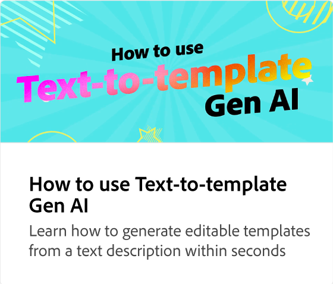

# Como editar um PDF

Saiba como dar uma remodelagem aos seus PDF estáticos e desatualizados adicionando textos, imagens, marcas, cores, animações atraentes e muito mais. Quando a edição estiver concluída, você pode baixar o PDF, compartilhar ou converter o PDF para outros formatos de arquivo, como JPEG.

>[!VIDEO](https://video.tv.adobe.com/v/3437903?quality=12&learn=on&hidetitle=true&captions=por_br)

## Vídeos adicionais desta série

<table style="table-layout:fixed">
<tr>
   <td>
         
   </td>
   <td>
         
   </td>
   <td>
         
   </td>
   <td>
         
   </td>      
</tr>
<tr>
   <td>
      
   </td>
   <td>
      
   </td>
   <td>
      
   </td>
    <td>
      
   </td>
</tr>
</table>
