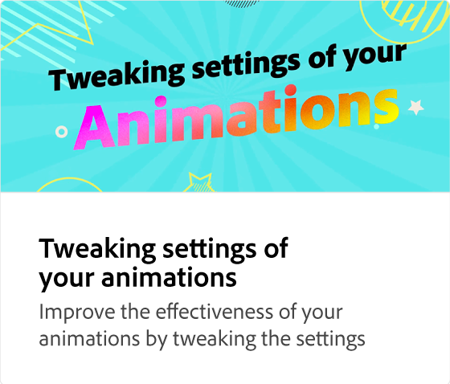

# Exportação de animações

Saiba como convidar pessoas para editar, publicar na Web, agendar uma publicação nas redes sociais ou baixar sua animação. O Adobe Express fornece recomendações para qual formato de arquivo exportar com base na sua situação.

>[!VIDEO](https://video.tv.adobe.com/v/3426985?quality=12&learn=on&hidetitle=true)

## Vídeos adicionais desta série

<table style="table-layout:fixed">
<tr>
   <td>
         
   </td>
  <td>
         
   </td>
   <td>
         
   </td>
   <td>
         
   </td>
</tr>
<tr>
    <td>
         
   </td>
   <td>
         
   </td>
   <td>
         
   </td>
   <td>
         
   </td>
</tr>
</table>
