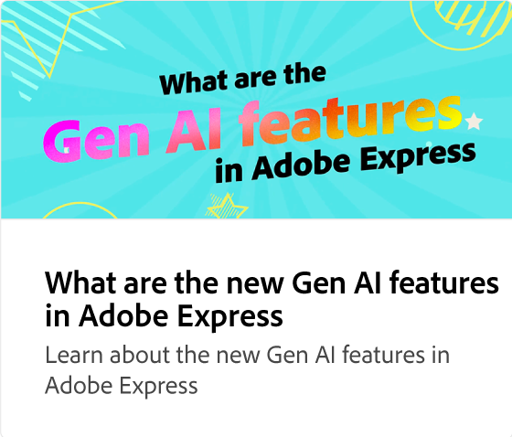
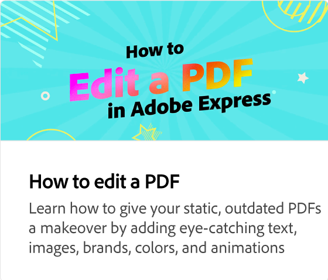

# Aprimorar o design de texto com a Gen AI

Saiba como criar designs impactantes usando efeitos de texto com o Adobe Firefly. Usando um prompt de texto, você pode gerar efeitos de texto extraordinários que podem ser refinados e embelezados.

>[!VIDEO](https://video.tv.adobe.com/v/3438818?captions=por_br&quality=12&learn=on&hidetitle=true)

## Vídeos adicionais desta série

<table style="table-layout:fixed">
<tr>
   <td>
         
   </td>
   <td>
         
   </td>
   <td>
         
   </td>
   <td>
         
   </td>      
</tr>
<tr>
   <td>
      
   </td>
   <td>
      
   </td>
   <td>
      
   </td>
   <td>
      
   </td>
</tr>
</table>
