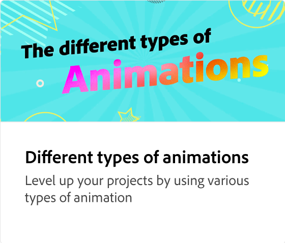

# Introdução às animações

Saiba como adicionar animação a uma publicação em redes sociais para aumentar o envolvimento. Para acessar o painel de animação, selecione qualquer elemento na página, como uma imagem, e aplique vários tipos de animação.

>[!VIDEO](https://video.tv.adobe.com/v/3426975?quality=12&learn=on&hidetitle=true)

## Vídeos adicionais desta série

<table style="table-layout:fixed">
<tr>
   <td>
         
   </td>
   <td>
         
   </td>
   <td>
         
   </td>
   <td>
         
   </td>
</tr>
<tr>
   <td>
         
   </td>
   <td>
         
   </td>
   <td>
         
   </td>
   <td>
         
   </td>
</tr>
</table>

