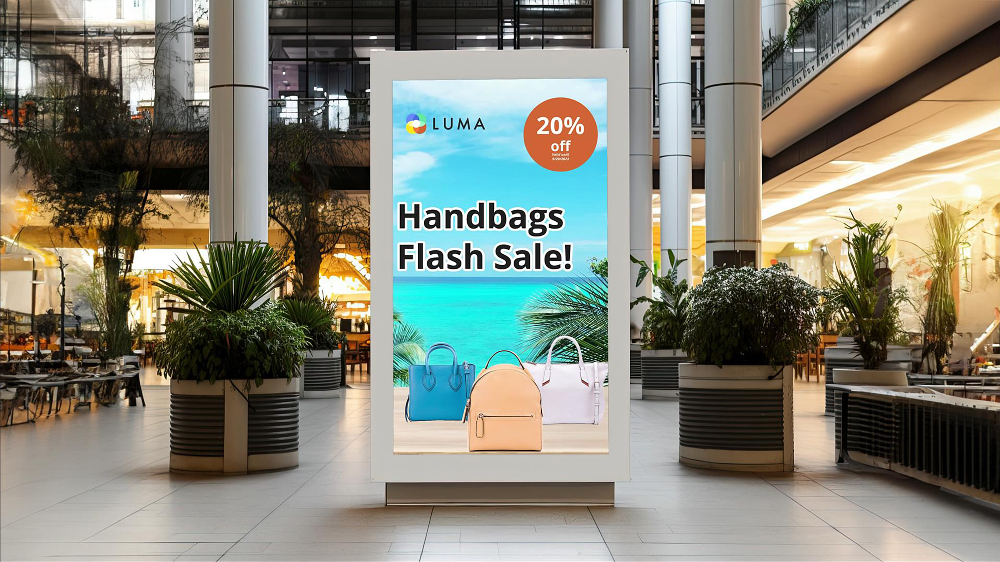

# Adobe [!DNL Express] tutoriais de caso de uso

Descubra como equipes diferentes em sua organização podem se beneficiar do Adobe Express.

## Novidades

* [Criar um visual promocional para um curso de aprendizado online](promo-visual.md)
Saiba como criar um visual envolvente para um curso de aprendizado online
* [Criação de um vídeo de fim de ano](end-of-year-video.md)
Saiba como criar um vídeo inspirador de fim de ano
* [Como criar uma newsletter](newsletter.md)
Saiba como criar a página inicial de um boletim informativo que pode ser usada para impressão, email ou publicação na Web

<table style="table-layout:fixed">
<tr>
   <td>
      
   </td>
   <td>
      
   </td>
   <td>
      
   </td>
   <td>
      
   </td>
</tr>
<tr>
   <td>
      
   </td>
   <td>
      
   </td>
   <td>
      
   </td>
   <td>
      
   </td>
</tr>
<tr>
   <td>
      
   </td>
   <td>
      
   </td>
   <td>
      
   </td>
   <td>
      
   </td>
</tr>
<tr>
   <td>
      
   </td>
   <td>
      
   </td>
   <td>
      
   </td>
   <td>
      
      

       
   </td>
</tr>
</table>
