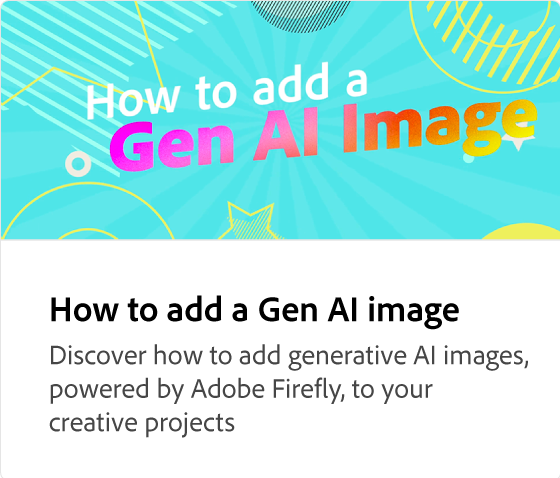
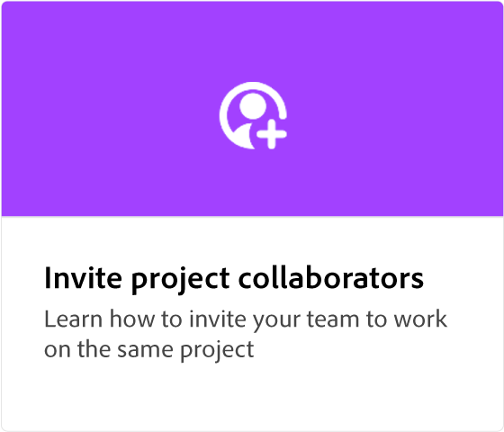

# UX de um projeto

Saiba como navegar no espaço de trabalho no Adobe Express. A área de trabalho inclui recursos avançados de pesquisa para encontrar planos de fundo, modelos de áudio e fotos. Você pode acessar suas próprias marcas e modelos e pesquisar temas específicos. A mídia pode ser carregada dos dispositivos ou escolhida no Adobe Stock collection. Ativos de design, planos de fundo, formas e ícones estão disponíveis para uso em projetos. Além disso, é possível convidar colegas para colaborar em designs de projetos.

>[!VIDEO](https://video.tv.adobe.com/v/3426932?quality=12&learn=on&hidetitle=true)

## Vídeos adicionais desta série

<table style="table-layout:fixed">
<tr>
 <td>
      
  </td>
   <td>
      
  </td>
   <td>
      
  </td>
   <td>
      
  </td>
</tr>
<tr>
   <td>
      
  </td>
   <td>
      
  </td>
   <td>
         
   </td>
    <td>
         
   </td>
</tr>
<tr>
    <td>
   
   </td>
   <td>
   
   </td>
   <td>
   
   </td>
    <td>
      
      

       
   </td>
</tr>
</table>
