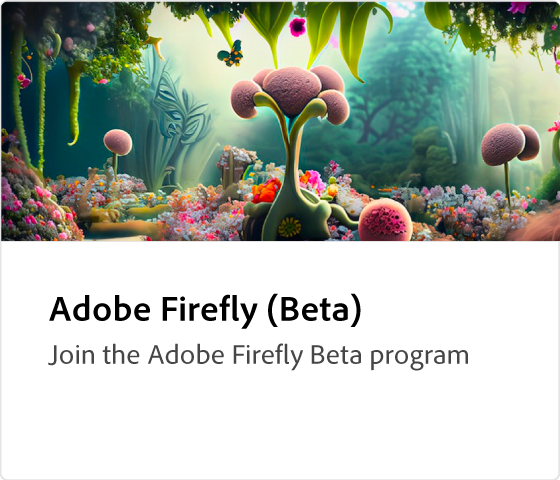

# Adobe [!DNL Firefly] visão geral

Firefly é a nova família de modelos de IA criativos e gerativos que chegam aos produtos Adobe, com foco inicial na geração de efeitos de imagem e texto. A Firefly oferece novas maneiras de idealizar, criar e se comunicar, melhorando significativamente os fluxos de trabalho criativos.

  

## Veja o que você pode fazer com Adobe Firefly

  

>[!VIDEO](https://video.tv.adobe.com/v/3416970t1?quality=12&learn=on&hidetitle=true)

## Saiba mais sobre o Adobe Firefly

<table style="table-layout:fixed">
<tr>
   <td>
      
  </td>
  <td>
      
  </td>
  <td>
      
  </td>
  <td>
    
    

     
  </td>
</tr>
</table>

## tutoriais do Firefly

<table style="table-layout:fixed">
<tr>
   <td>
      
   </td>
   <td>
      
   </td>
   <td>
      
  </td>
  <td>
      
  </td>
</tr>
<tr>
<td>
      
  </td>
<td>
    
    

     
  </td>
  <td>
    
    

     
  </td>
  <td>
    
    

     
  </td>
</tr>
</table>
