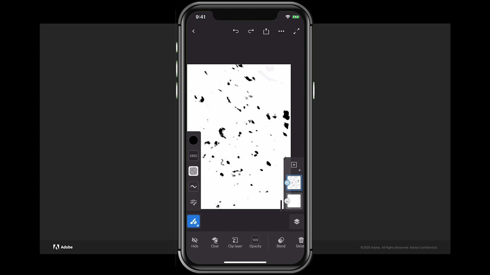

# Fresco

O Adobe Fresca é um aplicativo compatível com várias plataformas para criar desenhos e pinturas usando métodos baseados em pincel que combinam fluxos de trabalho vetoriais e rasterizados com documentos na nuvem.

## Procurar Tutorials de produtos

<table style="table-layout:fixed">
<tr>
 <td>
   
    

   <a href="fresco.md#tutorial1"><strong>Introdução ao desenho com o Adobe Fresca</strong></a>
    

    <em>Use as poderosas ferramentas de seleção e edição de cores do Adobe fresco para alterar drasticamente uma imagem para corresponder às suas necessidades de identidade corporativa</em>
     
  </td>
  <td>
   
    

   <a href="fresco.md#tutorial2"><strong>Criar arte texturizada: Fresco para o Illustrator</strong></a>
    

    <em>Pinte e desenhe texturas no Adobe Fresca e aprenda a usá-las no Illustrator</em>
     
  </td>
  <td>
    
    

     
  </td>
</tr>
</table>

## Introdução ao Desenho com o Adobe Fresca (19:07) {#tutorial1}

>[!VIDEO](https://video.tv.adobe.com/v/326946?hidetitle=true)

**Descrição**
Descubra o Adobe Fresca para criar desenhos e pinturas usando métodos baseados em pincel que combinam fluxos de trabalho vetoriais e rasterizados com documentos na nuvem.

Neste tutorial, você aprenderá como:
* Use pincéis vivos exclusivos que imitam aquarela e tinta a óleo com os seus pincéis de pixel e de vetor favoritos
* Crie efeitos texturizados colocando diferentes pincéis em camadas e utilizando máscaras
* Crie em qualquer lugar com o novo aplicativo Fresco para iPhone
* Exporte seu trabalho em vários formatos para usá-lo em outros aplicativos para dispositivos móveis e desktop

**Apresentado por:**
Liz Tanonis, Consultora de soluções (mídia digital)

## Criar Arte Texturizada — Fresco para o Illustrator (4:10) {#tutorial2}

>[!VIDEO](https://video.tv.adobe.com/v/326947?hidetitle=true)

**Descrição**
Pinte e desenhe texturas no Adobe Fresca e aprenda a usá-las no Illustrator.

Neste tutorial, você aprenderá como:
* Crie ilustrações no aplicativo da Adobe Fresca para iPhone e exporte-o para usar em outros aplicativos Creative Cloud
* Use a ferramenta Traçado de imagem no Illustrator para converter ilustrações em vetores
* Aplicar texturas feitas à mão à arte vetorial no Illustrator

**Apresentado por:**
Liz Tanonis, Consultora de soluções (mídia digital)

**Recursos do Fresco**

[Aprendizagem e Suporte](https://helpx.adobe.com/br/support/adobe-fresco.html) é o seu hub para tutoriais adicionais, [Novidades](https://helpx.adobe.com/br/fresco/using/whats-new.html) e links para fóruns da comunidade.

**Versão de outubro de 2020**

Comece a usar esses recursos (e muito mais!) baixando a atualização mais recente do seu aplicativo de desktop Creative Cloud.
