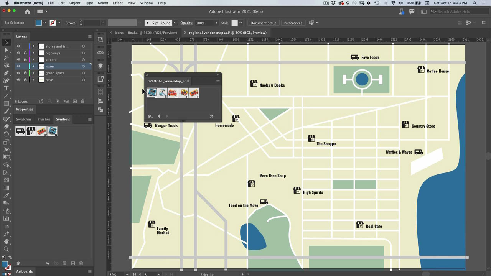

# Illustrator

O aplicativo moderno para ilustrações e gráficos. Crie logotipos, ícones, ilustrações e qualquer outro design que você possa imaginar para a Web, dispositivos móveis ou impressão.

## Procurar Tutorials de produtos

<table style="table-layout:fixed">
<tr>
 <td>
   
    

   <a href="illustrator.md#tutorial1"><strong>Usar Símbolos para Atualizar Várias Instâncias de Ícones</strong></a>
    

    <em>Reduza o trabalho manual e mantenha a consistência com símbolos</em>
     
  </td>
  <td>
    
    

    <a href="illustrator.md#tutorial2"><strong>Alinhar texto e imagens com o ajuste de glifo</strong></a>
    

    <em>Ajuste glifos rapidamente a regiões importantes do documento</em>
     
  </td>
  <td>
    
    

     
  </td>
</tr>
</table>

## Usar Símbolos para Atualizar Várias Instâncias de Ícone (5:08) {#tutorial1}

>[!VIDEO](https://video.tv.adobe.com/v/326816?hidetitle=true)

**Descrição**
Reduza o trabalho manual e mantenha a consistência com símbolos.

Neste tutorial, você aprenderá como:
* Reduzir o trabalho manual e manter a consistência com símbolos

**Apresentado por:**
Patti Sokol, Consultor Principal de Soluções (Mídia Digital)

## Alinhar Texto e Imagens com Ajuste de Glifos (6:48) {#tutorial2}

>[!VIDEO](https://video.tv.adobe.com/v/326817?hidetitle=true)

**Descrição**
Ajuste glifos rapidamente a regiões importantes do documento.

Neste tutorial, você aprenderá como:
* Ajuste glifos rapidamente a regiões importantes do documento

**Apresentado por:**
Patti Sokol, Consultor Principal de Soluções (Mídia Digital)

**Recursos do Illustrator**

[Aprendizagem e Suporte](https://helpx.adobe.com/support/illustrator.html) é o seu hub para tutoriais adicionais e links para fóruns da comunidade.

**Versão de outubro de 2020**

Comece a usar esses recursos (e muito mais!) baixando a atualização mais recente do seu aplicativo de desktop Creative Cloud.
