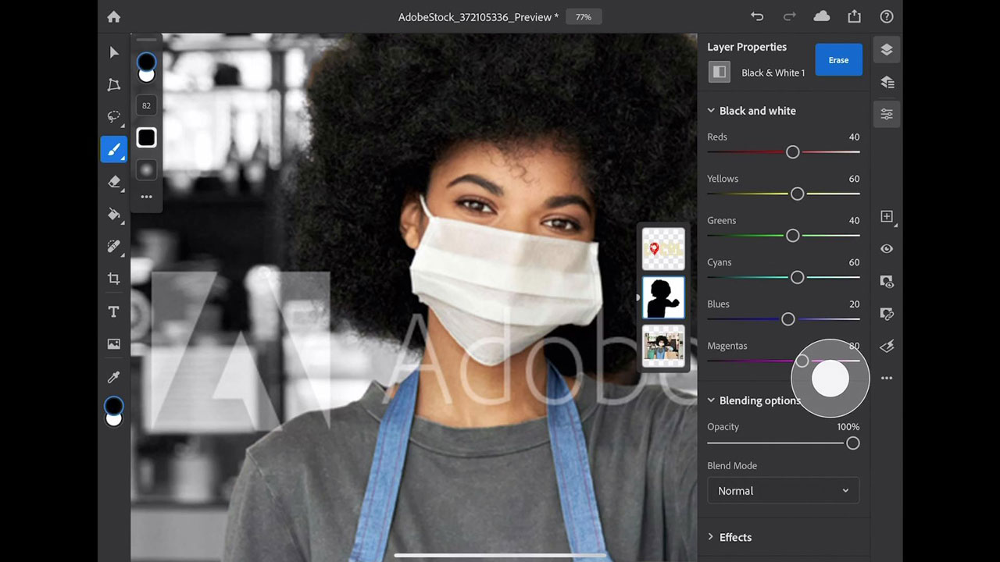

# Photoshop no iPad

O Photoshop é o melhor software de criação de imagens e design gráfico do mundo, permitindo criatividade ilimitada para profissionais em todos os dispositivos. Agora qualquer um pode criar qualquer coisa que imaginar, sempre que a inspiração surgir. Se você pode pensar, você pode fazer isso com o Photoshop.

## Procurar Tutorials de produtos

<table style="table-layout:fixed">
<tr>
 <td>
   
    

   <a href="photoshopipad.md#tutorial1"><strong>Introdução ao Photoshop no iPad</strong></a>
    

    <em>Faça um tour pela interface e aprenda alguns recursos encontrados no Photoshop reinventados para uso no Apple iPad</em>
     
  </td>
  <td>
    
    

     
  </td>
  <td>
    
    

     
  </td>
</tr>
</table>

## Introdução ao Photoshop no iPad (5:14) {#tutorial1}

>[!VIDEO](https://video.tv.adobe.com/v/326899?hidetitle=true)

**Descrição**
Faça um tour pela interface e aprenda alguns recursos encontrados no Photoshop reinventados para uso no Apple iPad.

Neste tutorial, você aprenderá como:
* Acesse suas ferramentas favoritas do Photoshop no
* Edição precisa em dispositivos móveis sem sacrificar a qualidade
* Mais experiência imersiva e natural
* Fluxo de trabalho contínuo com documentos na nuvem

**Apresentado por:**
Dan Armstrong, consultor de soluções (Mídia digital)

**Recursos do Photoshop no iPad**

[Aprendizagem e Suporte](https://helpx.adobe.com/br/support/photoshop.html) é o seu hub para tutoriais adicionais e links para fóruns da comunidade.

**Versão de outubro de 2020**

Comece a usar esses recursos (e muito mais!) baixando a atualização mais recente do seu aplicativo de desktop Creative Cloud.
