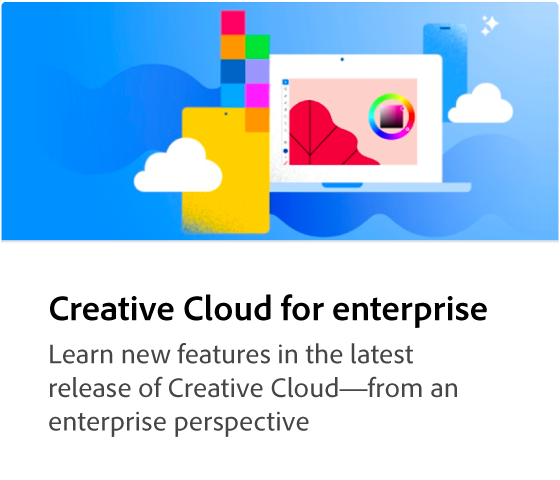

# Creative Cloud para tutoriais corporativos

Bem-vindo ao Creative Cloud para o centro de aprendizado corporativo. Aqui você encontra uma ampla variedade de experiências de aprendizado focadas no Creative Cloud para corporações. Nossos tutoriais, webinars e casos de uso foram criados para disponibilizar rapidamente para iniciantes e administradores os produtos Creative Cloud para corporações.

## Procurar tópicos

<table style="table-layout:fixed">
<tr>
  <td>
    
  </td>
  <td>
    
  </td>
  <td>
    
  </td>
  <td>
    
  </td>
</tr>
  <td>
   
  </td>
  <td>
  
  </td>
  <td>
    
  </td>
  <td>
    
  </td>
</tr>
</table>
